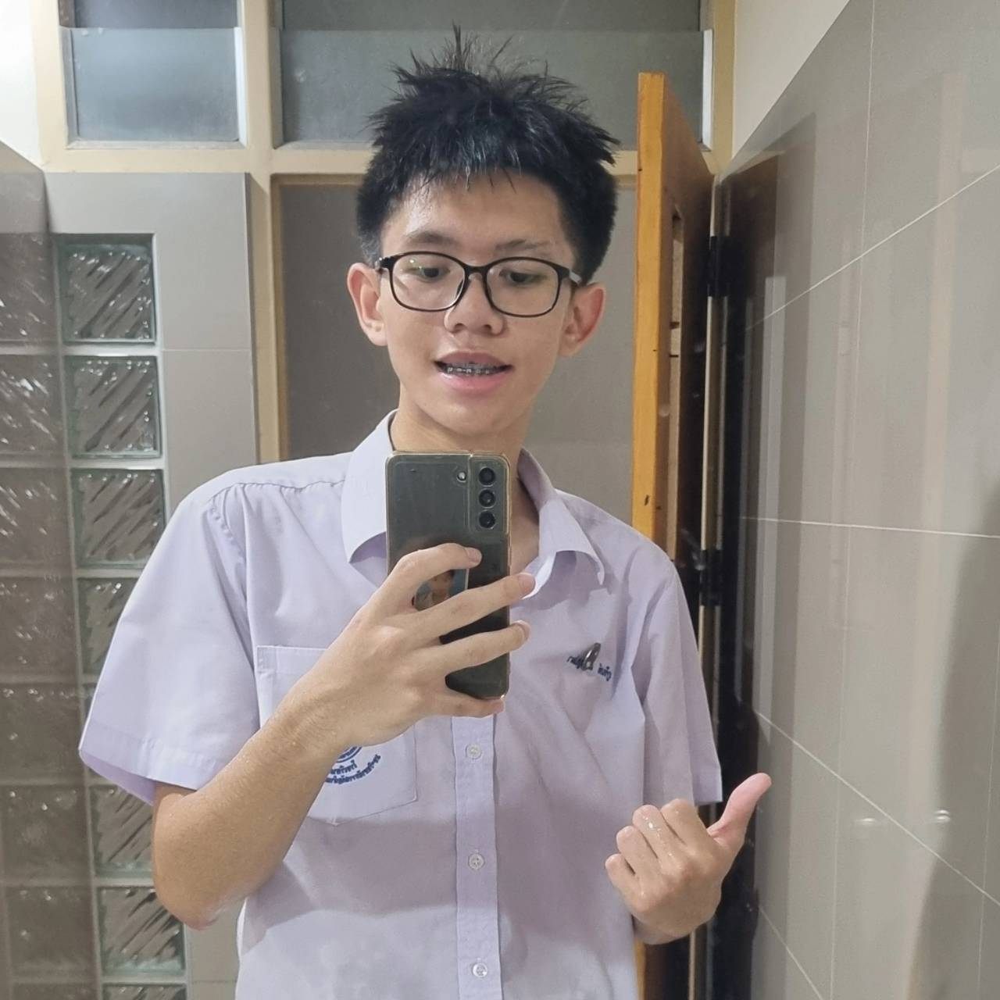
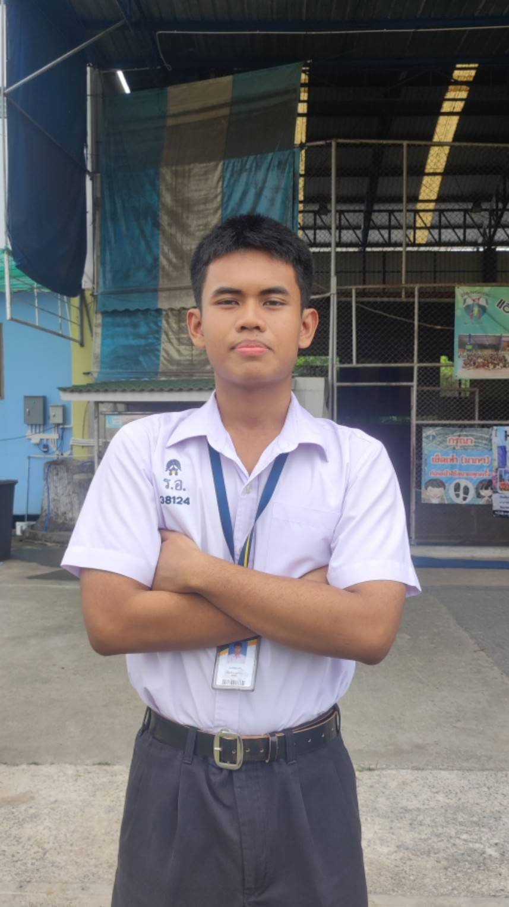

# Our Team #
# GANGROCKET #
**ชื่อทีมนี้ได้มาจากทั้งกลุ่มชื่นชอบโปเกม่อนครับ**

# ข้อมูลเพื่อนร่วมที่ได้มาจากการสัมภาษณ์ #

# 1. #
# ผู้สัมภาษณ์ เทสโต้ ผู้ถูกสัมภาษณ์ เปา #

## ข้อมูลส่วนตัว ##
ชื่อ-นามสกุล : 
ชื่อเล่น : 
วัน/เดือน/ปีเกิด : 
อายุ : 
ส่วนสูง น้ำหนัก : 
เรียนอยู่คณะอะไร สาขาอะไร :  

# คำถามสัมภาษณ์ #

## 1.ชอบอะไร? ##

## 2.อาหารที่ชอบ ##

## 3.ปกติในแต่ละวันใช้เวลาว่างไปกับการทำอะไร ##

## 4.แรงบันดาลใจในการเรียนที่นี้ ##

## 5.มีความฝันหรือเป้าหมายในอนาคตอย่างไร ##

## 6.เวลาเจอปัญหามีวิธีในการแก้ปัญหาอย่างไร ##

## 7.มีอะไรที่สนใจอยู่ช่วงนี้หรืออยากเรียนรู้อะไรเพิ่มเติมมั้ย ##

## contact ##
Github : 
Instargram :
Email :

# 2. #
# ผู้สัมภาษณ์ เคน ผู้ถูกสัมภาษณ์ เทสโต้ #

## ข้อมูลส่วนตัว ##
ชื่อ-นามสกุล : 
ชื่อเล่น : 
วัน/เดือน/ปีเกิด : 
อายุ : 
ส่วนสูง น้ำหนัก : 
เรียนอยู่คณะอะไร สาขาอะไร :  

# คำถามสัมภาษณ์ #

## 1.ชอบอะไร? ##

## 2.อาหารที่ชอบ ##

## 3.ปกติในแต่ละวันใช้เวลาว่างไปกับการทำอะไร ##

## 4.แรงบันดาลใจในการเรียนที่นี้ ##

## 5.มีความฝันหรือเป้าหมายในอนาคตอย่างไร ##

## 6.เวลาเจอปัญหามีวิธีในการแก้ปัญหาอย่างไร ##

## 7.มีอะไรที่สนใจอยู่ช่วงนี้หรืออยากเรียนรู้อะไรเพิ่มเติมมั้ย ##

## contact ##
Github : 
Instargram :
Email :

# 3. #
# ผู้สัมภาษณ์ เปา ผู้ถูกสัมภาษณ์ เคน #

## ข้อมูลส่วนตัว ##
ชื่อ-นามสกุล : ภูรินท์ เคนบุปผา
ชื่อเล่น : เคน
วัน/เดือน/ปีเกิด : 21/12/2007
อายุ : 18
ส่วนสูง น้ำหนัก : 177/60
เรียนอยู่คณะอะไร สาขาอะไร :  คณะเทคโนโลยีสารสนเทศ สาขาวิชาเทคโนโลยีสารสนเทศ

# คำถามสัมภาษณ์ #

## 1.ชอบอะไร? ##
- บาสเกตบอล 
- ชกมวย 
- ดูหนัง
## 2.อาหารที่ชอบ ##
- บะหมี่เป็ดย่าง
## 3.ปกติในแต่ละวันใช้เวลาว่างไปกับการทำอะไร ##
- เล่นเกม 
- ดูหนัง 
- เล่นกีฬา
## 4.แรงบันดาลใจในการเรียนที่นี้ ##
- จบไปมีงานทำเงินเดือนสูงๆ
## 5.มีความฝันหรือเป้าหมายในอนาคตอย่างไร ##
- มีเงินเยอะๆ 
- ไปเที่ยวรอบโลก
## 6.เวลาเจอปัญหามีวิธีในการแก้ปัญหาอย่างไร ##
- นั่งให้ใจเย็นลงก่อนแล้วค่อยๆ ลองคิดหาวิธีแก้ด้วยตัวเองถ้าไม่ได้ก็ขอความช่วยเหลือจากคนอื่น
## 7.มีอะไรที่สนใจอยู่ช่วงนี้หรืออยากเรียนรู้อะไรเพิ่มเติมมั้ย ##
- การลงทุน 
- การแต่งตัว

## contact ##
Github : [KenKenKub] (https://github.com/KenKenKub)
Instargram : [xphrnkx] (https://www.instagram.com/xphrnkx/?utm_source=ig_web_button_share_sheet)
Email : phurin.k123@gmail.com

# 4. #
# ผู้สัมภาษณ์ ซีเจ ผู้ถูกสัมภาษณ์ ชาร์จ #

 

## ข้อมูลส่วนตัว ##
ชื่อ-นามสกุล : 
ชื่อเล่น : 
วัน/เดือน/ปีเกิด : 
อายุ : 
ส่วนสูง น้ำหนัก : 
เรียนอยู่คณะอะไร สาขาอะไร :  

# คำถามสัมภาษณ์ #

## 1.ชอบอะไร? ##

## 2.อาหารที่ชอบ ##

## 3.ปกติในแต่ละวันใช้เวลาว่างไปกับการทำอะไร ##

## 4.แรงบันดาลใจในการเรียนที่นี้ ##

## 5.มีความฝันหรือเป้าหมายในอนาคตอย่างไร ##

## 6.เวลาเจอปัญหามีวิธีในการแก้ปัญหาอย่างไร ##

## 7.มีอะไรที่สนใจอยู่ช่วงนี้หรืออยากเรียนรู้อะไรเพิ่มเติมมั้ย ##

## contact ##
Github : 
Instargram :
Email :

# 5. #
# ผู้สัมภาษณ์ ชาร์จ ผู้ถูกสัมภาษณ์ ศิวัฒน์ #

 

## ข้อมูลส่วนตัว ##
ชื่อ-นามสกุล : ศิวัฒน์ มุกดา
ชื่อเล่น : ฟลุ๊ค
วัน/เดือน/ปีเกิด : 04/07/2550
อายุ : 19
ส่วนสูง น้ำหนัก : 175/75
เรียนอยู่คณะอะไร สาขาอะไร : สาขาอะไร:คณะเทคโนโลยีสารสนเทศ สาขาเทคโนโลยีสารสนเทศ 

# คำถามสัมภาษณ์ #

## 1.ชอบอะไร? ##
- ดูหนัง 
- ออกกำลังกาย

## 2.อาหารที่ชอบ ##
- ก๋วยเตี๋ยว

## 3.ปกติในแต่ละวันใช้เวลาว่างไปกับการทำอะไร ##
- เล่นเกม 
- ฟังเพลง
- ออกกำลังกาย

## 4.แรงบันดาลใจในการเรียนที่นี้ ##
- อยากได้ความรู้ที่ได้จากที่นี่ไปต่อยอดในการทำอาชีพในอนาคต

## 5.มีความฝันหรือเป้าหมายในอนาคตอย่างไร ##
- อยากเป็นฟรีแลนซ์ด้าน IT เพราะอยากทำงานที่ตัวเองชอบ

## 6.เวลาเจอปัญหามีวิธีในการแก้ปัญหาอย่างไร ##
- จะลองคิดและหาสาเหตุของปัญหาก่อน แล้วค่อยๆหาวิธีแก้เป็นขั้นตอน

## 7.มีอะไรที่สนใจอยู่ช่วงนี้หรืออยากเรียนรู้อะไรเพิ่มเติมมั้ย ##
- สนใจเรื่องการลงทุน อยากศึกษาวิธีลงทุนและการวางแผนการเงินให้มากขึ้น เพื่อที่จะได้นำไปใช้ในอนาคต

## contact ##
Github : siwat4477

Instargram : Siwat Mookda

Email : siwatmookda1@gmail.com

# 6. #
# ผู้สัมภาษณ์ ศิวัฒน์ ผู้ถูกสัมภาษณ์ ซีเจ #

 

## ข้อมูลส่วนตัว ##
ชื่อ-นามสกุล : 
ชื่อเล่น : 
วัน/เดือน/ปีเกิด : 
อายุ : 
ส่วนสูง น้ำหนัก : 
เรียนอยู่คณะอะไร สาขาอะไร :  

# คำถามสัมภาษณ์ #

## 1.ชอบอะไร? ##

## 2.อาหารที่ชอบ ##

## 3.ปกติในแต่ละวันใช้เวลาว่างไปกับการทำอะไร ##

## 4.แรงบันดาลใจในการเรียนที่นี้ ##

## 5.มีความฝันหรือเป้าหมายในอนาคตอย่างไร ##

## 6.เวลาเจอปัญหามีวิธีในการแก้ปัญหาอย่างไร ##

## 7.มีอะไรที่สนใจอยู่ช่วงนี้หรืออยากเรียนรู้อะไรเพิ่มเติมมั้ย ##

## contact ##
Github : 
Instargram :
Email :