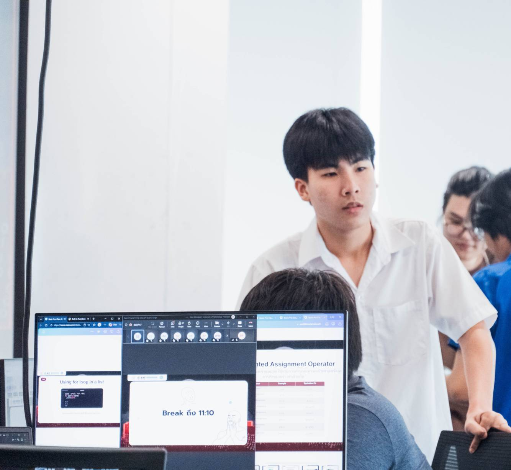
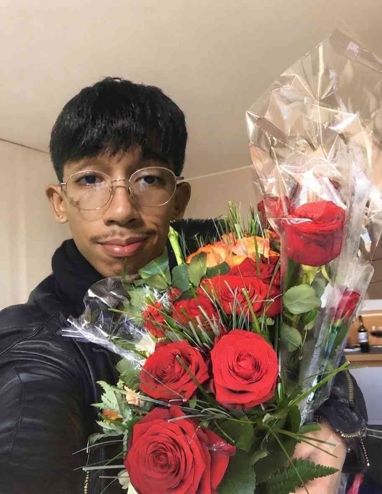
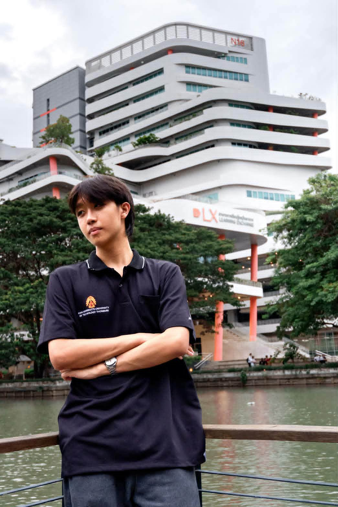

# Our Team #
# GANGROCKET #
**ชื่อทีมนี้ได้มาจากทั้งกลุ่มชื่นชอบโปเกม่อนครับ**

# ข้อมูลเพื่อนร่วมที่ได้มาจากการสัมภาษณ์ #

# 1. #
# ผู้สัมภาษณ์ เทสโต้ ผู้ถูกสัมภาษณ์ เปา #

## ข้อมูลส่วนตัว ##
ชื่อ-นามสกุล : บุญญา ปานบุญลือ
ชื่อเล่น : เปา
วัน/เดือน/ปีเกิด : 20/1/2551
อายุ : 18
ส่วนสูง น้ำหนัก : 169 เซนติเมตร 55 กิโลกรัม
เรียนอยู่คณะอะไร สาขาอะไร :  คณะ SIT สาขา IT

# คำถามสัมภาษณ์ #

## 1.ชอบอะไร? ##
ชอบได้ลองอะไรใหม่ๆ ท้าทายตัวเองด้วยสิ่งที่ยากขึ้น
## 2.อาหารที่ชอบ ##
สเต็ก
ผัดกระเพราร้านป้าแต๋ว ซอย 28
ชาไทยปั่น
## 3.ปกติในแต่ละวันใช้เวลาว่างไปกับการทำอะไร ##
ทบทวนบทเรียน
ทำการบ้าน
เล่นเกม
เล่นบาส
## 4.แรงบันดาลใจในการเรียนที่นี้ ##
เพราะเราคิดว่า ตัวเราถนัดกับสายนี้มาตั้งแต่แรกเราชอบที่จะได้ทำ เว็บ แอพ แต่ในตอนแรกสุดก็ไม่ได้คิดที่จะเข้า คณะนี้นะ ตอนแรกคิดว่าจะเข้า cmm เพราะค่าเทอมถูกกว่า แถมเรียนอะไรคล้ายๆกันอยู่ก็เลยคิดว่าจะเข้า cmm แต่ก็เคยสมัครทุนเพรชพระจอมของ dsi เพราะตอนนั้นคิดว่าตัวเองถนัดด้านธุรกิจ เข้าใจตลาดมากกว่าการเขียนโค้ดก็เลยสมัครไป ซึ่งก็ติด แต่ไม่ใช่ทุนเพรชแต่คือโครงการ active recuitment เหมือนจะเพราะไม่ติดทุนแต่ผ่านเกณที่จะเข้าเรียนก็เลยได้เข้าประมาณนั้นมั้ง แต่สุดท้ายก็ไม่เอาทั้งคู่ cmm ก็รู้สึกว่าเรียนไปอาจไม่มีความสุข dsi ก็ค่าเทอมสูงเกินไปก็เลยมาจบที่ IT เพราะคิดว่าตัวเองเหมาะกับสาขานี้มากที่สุด
## 5.มีความฝันหรือเป้าหมายในอนาคตอย่างไร ##
ในอนาคตก็อยากที่จะเป็น full stack ที่สามารถเปิดบริษัทของตัวเองแล้วสามารถเป็นผู้นำที่ดีได้ แล้วพอถึงจุดอิ่มตัวทุกอย่าง ก็อยากเรียนให้ จบ โท เอก แล้วมาสมัครเป็นอาจารย์ที่นี้เพราะอยากมีความรู้สึกของการเป็นผู้สอนว่าการได้เห็นลูกศิษย์จบไปจะเป็นยังไง
## 6.เวลาเจอปัญหามีวิธีในการแก้ปัญหาอย่างไร ##
เข้าใจปัญหา แยกปัญหาเป็นส่วนๆ แล้วค่อยแก้ทีละจุด
## 7.มีอะไรที่สนใจอยู่ช่วงนี้หรืออยากเรียนรู้อะไรเพิ่มเติมมั้ย ##
ช่วงนี้สนใจเป็นเรื่องการเรียนอยากเรียนให้ดีเพื่อที่จะขอทุนได้พอได้ทุนอย่างน้อยก็แบ่งเบาภาระได้ อยากเรียนรู้เรื่องพวกที่เกี่ยวกับสายงานของตัวเองว่าต้องเสริมอะไรไหมช่วงนี้ก็จะเป็น Js Node ประมาณนี้
## contact ##
Github : https://github.com/boonyalol
Instargram :https://www.instagram.com/pao_pk_1509?igsh=MWJmYnIwZ3R0aXJ5eA==
Email :บุญญา ปานบุญลือ
เปา 
20/1/2551
18
169 เซนติเมตร 55 กิโลกรัม
คณะ SIT สาขา IT

1. - ชอบได้ลองอะไรใหม่ๆ ท้าทายตัวเองด้วยสิ่งที่ยากขึ้น
2.- สเต็ก
- ผัดกระเพราร้านป้าแต๋ว ซอย 28
- ชาไทยปั่น
3.- ทบทวนบทเรียน
- ทำการบ้าน
- เล่นเกม
- เล่นบาส
4.- เพราะเราคิดว่า ตัวเราถนัดกับสายนี้มาตั้งแต่แรกเราชอบที่จะได้ทำ เว็บ แอพ แต่ในตอนแรกสุดก็ไม่ได้คิดที่จะเข้า คณะนี้นะ ตอนแรกคิดว่าจะเข้า cmm เพราะค่าเทอมถูกกว่า แถมเรียนอะไรคล้ายๆกันอยู่ก็เลยคิดว่าจะเข้า cmm แต่ก็เคยสมัครทุนเพรชพระจอมของ dsi เพราะตอนนั้นคิดว่าตัวเองถนัดด้านธุรกิจ เข้าใจตลาดมากกว่าการเขียนโค้ดก็เลยสมัครไป ซึ่งก็ติด แต่ไม่ใช่ทุนเพรชแต่คือโครงการ active recuitment เหมือนจะเพราะไม่ติดทุนแต่ผ่านเกณที่จะเข้าเรียนก็เลยได้เข้าประมาณนั้นมั้ง แต่สุดท้ายก็ไม่เอาทั้งคู่ cmm ก็รู้สึกว่าเรียนไปอาจไม่มีความสุข dsi ก็ค่าเทอมสูงเกินไปก็เลยมาจบที่ IT เพราะคิดว่าตัวเองเหมาะกับสาขานี้มากที่สุด
5. - ในอนาคตก็อยากที่จะเป็น full stack ที่สามารถเปิดบริษัทของตัวเองแล้วสามารถเป็นผู้นำที่ดีได้ แล้วพอถึงจุดอิ่มตัวทุกอย่าง ก็อยากเรียนให้ จบ โท เอก แล้วมาสมัครเป็นอาจารย์ที่นี้เพราะอยากมีความรู้สึกของการเป็นผู้สอนว่าการได้เห็นลูกศิษย์จบไปจะเป็นยังไง
6. - เข้าใจปัญหา แยกปัญหาเป็นส่วนๆ แล้วค่อยแก้ทีละจุด
7. - ช่วงนี้สนใจเป็นเรื่องการเรียนอยากเรียนให้ดีเพื่อที่จะขอทุนได้พอได้ทุนอย่างน้อยก็แบ่งเบาภาระได้ อยากเรียนรู้เรื่องพวกที่เกี่ยวกับสายงานของตัวเองว่าต้องเสริมอะไรไหมช่วงนี้ก็จะเป็น Js Node ประมาณนี้

contact
github: [boonyalol] (https://github.com/boonyalol)
ig: [pao_pk_1509] (https://www.instagram.com/pao_pk_1509?igsh=MWJmYnIwZ3R0aXJ5eA==)
email: boonyapanboonlue@gmail.com

# 2. #
# ผู้สัมภาษณ์ เคน ผู้ถูกสัมภาษณ์ เทสโต้ #

## ข้อมูลส่วนตัว ##
ชื่อ-นามสกุล : 
ชื่อเล่น : 
วัน/เดือน/ปีเกิด : 
อายุ : 
ส่วนสูง น้ำหนัก : 
เรียนอยู่คณะอะไร สาขาอะไร :  

# คำถามสัมภาษณ์ #

## 1.ชอบอะไร? ##

## 2.อาหารที่ชอบ ##

## 3.ปกติในแต่ละวันใช้เวลาว่างไปกับการทำอะไร ##

## 4.แรงบันดาลใจในการเรียนที่นี้ ##

## 5.มีความฝันหรือเป้าหมายในอนาคตอย่างไร ##

## 6.เวลาเจอปัญหามีวิธีในการแก้ปัญหาอย่างไร ##

## 7.มีอะไรที่สนใจอยู่ช่วงนี้หรืออยากเรียนรู้อะไรเพิ่มเติมมั้ย ##

## contact ##
Github : 
Instargram :
Email :

# 3. #
# ผู้สัมภาษณ์ เปา ผู้ถูกสัมภาษณ์ เคน #

## ข้อมูลส่วนตัว ##
ชื่อ-นามสกุล : ภูรินท์ เคนบุปผา
ชื่อเล่น : เคน
วัน/เดือน/ปีเกิด : 21/12/2007
อายุ : 18
ส่วนสูง น้ำหนัก : 177/60
เรียนอยู่คณะอะไร สาขาอะไร :  คณะเทคโนโลยีสารสนเทศ สาขาวิชาเทคโนโลยีสารสนเทศ

# คำถามสัมภาษณ์ #

## 1.ชอบอะไร? ##
- บาสเกตบอล 
- ชกมวย 
- ดูหนัง
## 2.อาหารที่ชอบ ##
- บะหมี่เป็ดย่าง
## 3.ปกติในแต่ละวันใช้เวลาว่างไปกับการทำอะไร ##
- เล่นเกม 
- ดูหนัง 
- เล่นกีฬา
## 4.แรงบันดาลใจในการเรียนที่นี้ ##
- จบไปมีงานทำเงินเดือนสูงๆ
## 5.มีความฝันหรือเป้าหมายในอนาคตอย่างไร ##
- มีเงินเยอะๆ 
- ไปเที่ยวรอบโลก
## 6.เวลาเจอปัญหามีวิธีในการแก้ปัญหาอย่างไร ##
- นั่งให้ใจเย็นลงก่อนแล้วค่อยๆ ลองคิดหาวิธีแก้ด้วยตัวเองถ้าไม่ได้ก็ขอความช่วยเหลือจากคนอื่น
## 7.มีอะไรที่สนใจอยู่ช่วงนี้หรืออยากเรียนรู้อะไรเพิ่มเติมมั้ย ##
- การลงทุน 
- การแต่งตัว

## contact ##
Github : [KenKenKub](https://github.com/KenKenKub)
Instargram : [xphrnkx](https://www.instagram.com/xphrnkx/?utm_source=ig_web_button_share_sheet)
Email : phurin.k123@gmail.com

# 4. #
# ผู้สัมภาษณ์ ซีเจ ผู้ถูกสัมภาษณ์ ชาร์จ #

## ข้อมูลส่วนตัว ##
ชื่อ-นามสกุล : ;วณัชพล อาจจิตร์
ชื่อเล่น : ชาร์จ
วัน/เดือน/ปีเกิด : 23/08/2550 
อายุ : 180
ส่วนสูง น้ำหนัก : 175 60 
เรียนอยู่คณะอะไร สาขาอะไร : เทคโนโลยีสารสนเทศ สาขาเทคโนโลยีสารสนเทศ  

# คำถามสัมภาษณ์ #

## 1.ชอบอะไร? ##
 ชกมวย เล่นเวท
## 2.อาหารที่ชอบ ##
 สเต็ก
## 3.ปกติในแต่ละวันใช้เวลาว่างไปกับการทำอะไร ##
 ชกมวย ดูหนัง
## 4.แรงบันดาลใจในการเรียนที่นี้ ##
 รุ่นพี่จบจากที่นี้
## 5.มีความฝันหรือเป้าหมายในอนาคตอย่างไร ##
 อยากหาเงิยจากการเขียนโค้ด อยากลงชกมวยสักครั้ง
## 6.เวลาเจอปัญหามีวิธีในการแก้ปัญหาอย่างไร ##
 หาปัญหาทีล่ะขั้นตอนและหาวิธีแก้
## 7.มีอะไรที่สนใจอยู่ช่วงนี้หรืออยากเรียนรู้อะไรเพิ่มเติมมั้ย ##
เรียน js และเรียน มวยไทย มวยสากล
## contact ##
Github : chargcharg2308-cloud
Instargram : wxrkkk_c
Email : chargcharg2308@gmail.com
# 5. #
# ผู้สัมภาษณ์ ชาร์จ ผู้ถูกสัมภาษณ์ ศิวัฒน์ #

 

## ข้อมูลส่วนตัว ##
ชื่อ-นามสกุล : ศิวัฒน์ มุกดา
ชื่อเล่น : ฟลุ๊ค
วัน/เดือน/ปีเกิด : 04/07/2550
อายุ : 19
ส่วนสูง น้ำหนัก : 175/75
เรียนอยู่คณะอะไร สาขาอะไร : สาขาอะไร:คณะเทคโนโลยีสารสนเทศ สาขาเทคโนโลยีสารสนเทศ 

# คำถามสัมภาษณ์ #

## 1.ชอบอะไร? ##
- ดูหนัง 
- ออกกำลังกาย

## 2.อาหารที่ชอบ ##
- ก๋วยเตี๋ยว

## 3.ปกติในแต่ละวันใช้เวลาว่างไปกับการทำอะไร ##
- เล่นเกม 
- ฟังเพลง
- ออกกำลังกาย

## 4.แรงบันดาลใจในการเรียนที่นี้ ##
- อยากได้ความรู้ที่ได้จากที่นี่ไปต่อยอดในการทำอาชีพในอนาคต

## 5.มีความฝันหรือเป้าหมายในอนาคตอย่างไร ##
- อยากเป็นฟรีแลนซ์ด้าน IT เพราะอยากทำงานที่ตัวเองชอบ

## 6.เวลาเจอปัญหามีวิธีในการแก้ปัญหาอย่างไร ##
- จะลองคิดและหาสาเหตุของปัญหาก่อน แล้วค่อยๆหาวิธีแก้เป็นขั้นตอน

## 7.มีอะไรที่สนใจอยู่ช่วงนี้หรืออยากเรียนรู้อะไรเพิ่มเติมมั้ย ##
- สนใจเรื่องการลงทุน อยากศึกษาวิธีลงทุนและการวางแผนการเงินให้มากขึ้น เพื่อที่จะได้นำไปใช้ในอนาคต

## contact ##
Github : siwat4477

Instargram : Siwat Mookda

Email : siwatmookda1@gmail.com

# 6. #
# ผู้สัมภาษณ์ ศิวัฒน์ ผู้ถูกสัมภาษณ์ ซีเจ #

 

## ข้อมูลส่วนตัว ##
ชื่อ-นามสกุล :  สุวิจักษณ์ กิติวัชระเจริญ
ชื่อเล่น : CJ
วัน/เดือน/ปีเกิด : 26/06/2551
อายุ : 18
ส่วนสูง น้ำหนัก : 177/55
เรียนอยู่คณะอะไร สาขาอะไร :  คณะเทคโนโลยีสารสนเทศ สาขาเทคโนโลยีสารสนเทศ
คำถามสัมภาษณ์

# คำถามสัมภาษณ์ #

## 1.ชอบอะไร? ##
-ชีววิทยา
-ขนมหวาน
## 2.อาหารที่ชอบ ##
-ข้าวแกงกะหรี่
## 3.ปกติในแต่ละวันใช้เวลาว่างไปกับการทำอะไร ##
-หางานแข่งพัฒนาตนเอง
## 4.แรงบันดาลใจในการเรียนที่นี้ ##
-การเป็นนักชีวะสารสนเทศ
## 5.มีความฝันหรือเป้าหมายในอนาคตอย่างไร ##
-อยากจะทำงานแล้วเปิดร้านเบเกอรี่
## 6.เวลาเจอปัญหามีวิธีในการแก้ปัญหาอย่างไร ##
-จะนำปัญหามาหาวิธีแก้และจะแก้ไขปัญหาไปทีละข้อ
## 7.มีอะไรที่สนใจอยู่ช่วงนี้หรืออยากเรียนรู้อะไรเพิ่มเติมมั้ย ##
-สนใจทางด้านการเงินและอยากจะศึกษาเพราะข้อมูลการเงินเป็นข้อมูลระยะยาว
## contact ##
Github : cjsuwijuck-web
Instargram : cj.suwi
Email : cj.suwijuck@gmail.com
